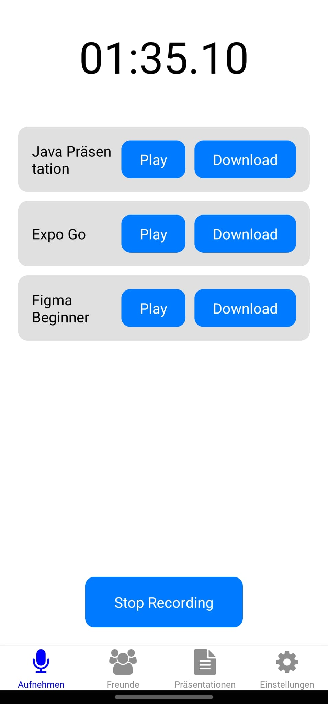

# Mobile Anwendung Dokumentation

Diese mobile Anwendung wurde mit React Native und TypeScript entwickelt und besteht aus mehreren Hauptkomponenten:

## Hauptkomponenten

### 1. Landing Screen
- **Beschreibung**: Der erste Bildschirm, den Benutzer sehen, wenn sie die App öffnen.
- **Funktionalitäten**:
    - Anmelden
    - Registrieren

### 2. Aufnahmen
- **Beschreibung**: Ermöglicht Benutzern das Erstellen und Verwalten von Audioaufnahmen.
- **Funktionalitäten**:
    - Audioaufnahmen erstellen
    - Audioaufnahmen speichern
    - Audioaufnahmen abspielen
    - Audioaufnahmen herunterladen (funktioniert leider nur auf Android)
    - Audioaufnahmen löschen
- **Speicherung**: Jede Aufnahme wird mit einem eindeutigen Namen gespeichert und kann später abgerufen werden.
- Leider habe ich es nicht geschaft eine gute API zu finden um Speach to Text zu machen, desshalb habe ich den Text für die Aufnahmen hardcoded.

### 3. Freunde
- **Beschreibung**: Ermöglicht Benutzern das Hinzufügen und Verwalten ihrer Freunde.
- **Funktionalitäten**:
    - Freunde hinzufügen
    - Freunde verwalten

### 4. Präsentationen
- **Beschreibung**: Benutzer können hier ihre erstellten Präsentationen sehen, teilen oder löschen.
- **Funktionalitäten**:
    - Präsentationen anzeigen (Die Präsentationen sind aktuell noch hardcoded und werden nicht dynamisch generiert)
    - Präsentationen teilen (funktioniert leider nur auf Android)
    - Präsentationen löschen
- **Speicherung**: Präsentationen sind HTML-Inhalte, die in der Firestore-Datenbank gespeichert werden. Jede Präsentation ist mit der Benutzer-ID verknüpft, sodass nur der erstellende Benutzer darauf zugreifen kann.

### 5. Einstellungen
- **Beschreibung**: Ermöglicht Benutzern das Verwalten ihrer Kontoeinstellungen und das Ausloggen.
- **Funktionalitäten**:
    - Kontoeinstellungen verwalten
    - Ausloggen
    - Anzeige der aktuell eingeloggen Emailadresse

## Technologien

Die Anwendung verwendet Firebase für die Authentifizierung und Firestore für die Datenspeicherung. Sie nutzt auch verschiedene Expo-Module wie expo-av für Audioaufnahmen, expo-file-system für Dateioperationen und expo-sharing für das Teilen von Dateien.

## Figma-Design
- **Appstore**: https://www.figma.com/design/2MlPESOd1TkZvOLr8pUEY7/Appstore-Page-Template-(Community)?node-id=701-2768&t=PHkNEv3CBTMOZYfp-1
- **Figma Design**: https://www.figma.com/design/nYQe1Zlh2YmYPT4yWoB76t/Untitled?node-id=6-564&t=1tZ9cMnv0brYO5QK-1